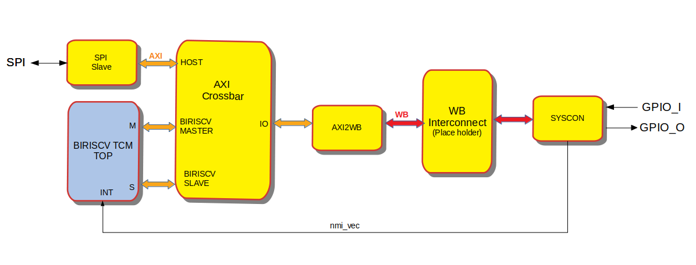

AltuSOC
========

AltuSOC is a riscv SOC targeted for controlling PHY/ Mixed Signal type of ICs. It is a [FuseSoC](https://github.com/olofk/fusesoc)-compatible SoC forked from SweRVolf, with significant modifications including replacement of the [EH1](https://github.com/chipsalliance/Cores-SweRV.git) core with [biriscv](https://github.com/altuSemi/biriscv.git) RISC-V core, to acheive lower LUT usage and implementation in the [Zybo](https://reference.digilentinc.com/reference/programmable-logic/zybo/start) board. Another reason for the CPU switch was that the existing SOC was using CPU external (SOC level/ off-chip) memory and the biriscv TCM top includes tightly coupled RAM.

# Structure

                                                                     *AltuSOC Core*

## AltuSOC Core

The core of ALTUSOC consists of the biriscv TCM top level - with biriscv CPU , 16KB of ROM and 48KB of RAM, [Pulp](https://github.com/pulp-platform/axi) AXI4 interconnect, [Pulp](https://github.com/pulp-platform/axi_spi_slave) SPI slave interafce, WB periphery interconnect and GPIO. 

### Memory map

| Core     | Address               |
| -------- | --------------------- |
| ROM      | 0x00000000-0x00003FFF |
| RAM      | 0x00004000-0x0000FFFF |
| Reserved | 0x00010000-0x0FFFFFFF |
| syscon   | 0x10001000-0x10001FFF |
| Reserved | 0x10002000-0xFFFFFFFF |

## AltuSOC sim

AltuSOC sim is a simulation target that wraps the AltuSOC core in a testbench to be used by verilator or Vivado. It can be used for full-system simulations that executes programs running on biriscv. 

*AltuSOC Simulation target*

The simulation target exposes a number of parameters for compile-time and run-time configuration. These parameters are all exposed as FuseSoC parameters. The most relevant parameters are:

* `--rom_init_file` : Loads a Verilog hex file to use as initial on-chip RAM contents
* `--vcd` : Enable VCD dumping

Memory files suitable for loading with `--rom_init_file` can be compiled and linked to binary files , then converted to hex files with the `sw/build/Makefile` and `sw/build/make_vh.sh` scripts. The Makefile is using the riscv toolchain availible for installation [here](https://mindchasers.com/dev/rv-getting-started).

## AltuSOC Zybo

AltuSOC can be mapped to the Digilent Zybo board (Excluding the SPI host I/F), using the tcl script `tools/create_proj.tcl`. 

# How to use

## Prerequisites

Install [verilator](https://www.veripool.org/wiki/verilator)

Create an empty directory, e.g. named altusoc, to use as the root of the project. This directory will from now on be called `$WORKSPACE`. All further commands will be run from `$WORKSPACE` unless otherwise stated. After entering the workspace directory, run `export WORKSPACE=$(pwd)` to set the $WORKSPACE shell variable.

1. Make sure you have [FuseSoC](https://github.com/olofk/fusesoc) installed or install it with `pip install fusesoc`
2. Add the FuseSoC base library to the workspace with `fusesoc library add fusesoc-cores https://github.com/fusesoc/fusesoc-cores`
3. Add the AltuSOC library with `fusesoc library add altusoc https://github.com/chipsalliance/Cores-biriscv-AltuSOC`
4. Make sure you have verilator installed to run the simulation. **Note** This requires at least version 3.918. The version that is shipped with Ubuntu 18.04 will NOT work

Your workspace shall now look like this:

    $WORKSPACE
    └──fusesoc_libraries
       ├──fusesoc-cores
       └──swervolf

After step 3, the AltuSOC sources will be located in `$WORKSPACE/fusesoc_libraries/altusoc`. For convenience, this directory will from now on be refered to as `$ALTUSOC_ROOT`. Run `export ALTUSOC_ROOT=$WORKSPACE/fusesoc_libraries/altusoc` to set this as a shell variable

## Running the SoC

The AltuSOC SoC can be run in simulation or on hardware (Digilent Zybo currently supported). In former FuseSoC is used to launch the simulation, for later vivado is launch with `tools/create_proj.tcl` script or build simulate and run the FPGA . 

To run simulation use

    fusesoc run --target=sim altusoc

This will load a small example program into the biriscv ROM that sets the 4 GPIO_O lsbits to 1 one after the other ,  turns them off in the same order and exits. The delay between each GPIO access is set to 300ms and measured with the biriscv emebeded timer.
The code was developed based on this [riscv ASM tutorial](https://www.youtube.com/watch?v=tthKXGxAUjY&list=PL6noQ0vZDAdh_aGvqKvxd0brXImHXMuLY&index=6).
The simulation prints will look like:

If you want to rerun the program without rebuilding the simulation model, you can add the --run parameter

    fusesoc run --target=sim --run altusoc

To build (and optionally program) an image for a Zybo board, run

    vivado -notrace -mode batch -source <Cores-biriscv-AltuSOC repo path>/tools/create_proj.tcl

Currently only gate level (Synthesis/ Implemntation w or w/o timing annotated) simulation is supported. The snippet below includes the waveform of the 4 GPIO bits and the timer/PC in analog format.

The tcl script also include a debug core which can plot the same signals from the zybo board:

The below video shown the programmed Zybo board:

## TODO:
- Support SPI port in simulation
- Map FreeRTOS to AltuSOC
